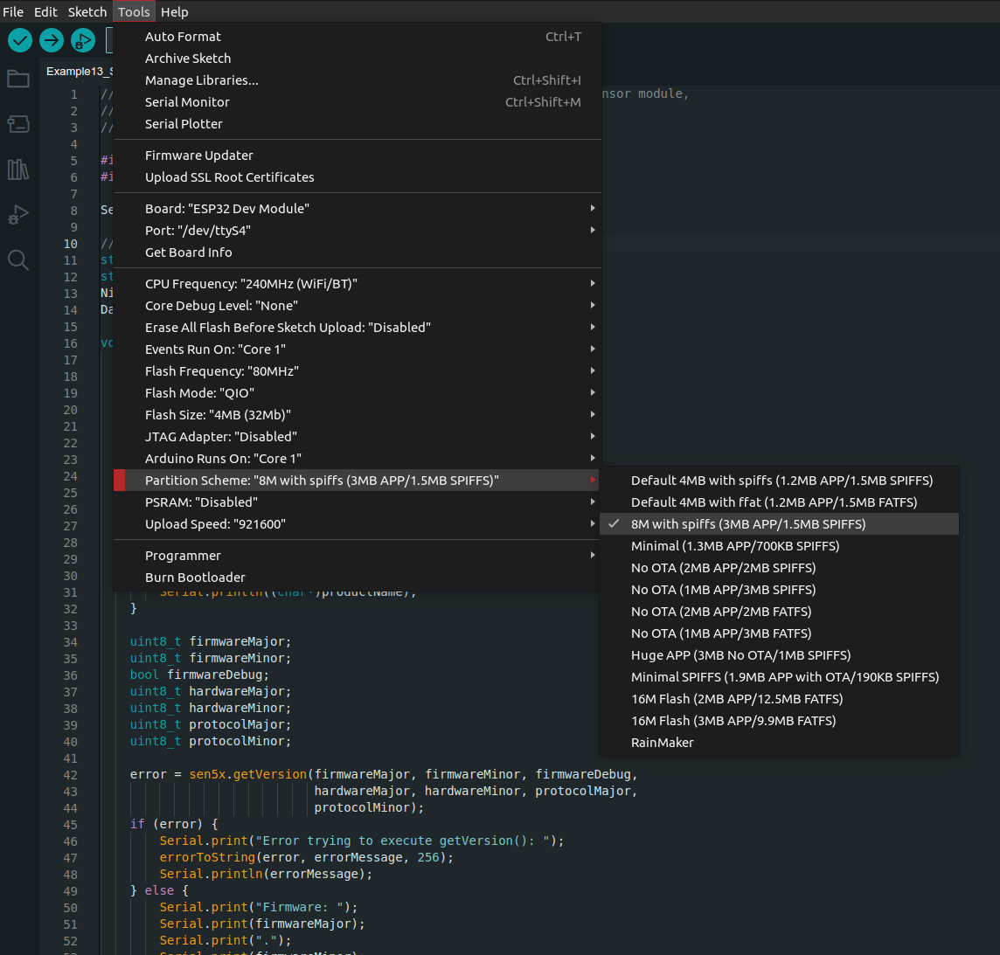

# Sensirion Gadget BLE Library

[](https://www.ardu-badge.com/Sensirion%20Gadget%20BLE%20Arduino%20Lib) [](https://registry.platformio.org/libraries/sensirion/Sensirion%20Gadget%20BLE%20Arduino%20Lib)

This library enables you to create your own Do-It-Yourself BLE enabled sensor gadget on the ESP32 platform.

**Note: The library has changed in version 1.0.0 and won't work with code using version 0.14.0 or earlier. For a detailed guide on how to migrate your code, click [here](MIGRATION.md).**

### Key features are

- Live sensor value broadcasting without requiring a BLE connection
- Simultaneous monitoring of sensor data from multiple BLE clients
- **Sensirion MyAmbience CO2** App compatibility - allows you to monitor your gadgets, plot the sensor values and share/export the data.
- Buffering of sensor data for later download (sensor history download)

**Please see the examples provided as reference on how to use this library.**

Important points to keep in mind:

- `writeValueToCurrentSample` writes the sensor values to the library. But the values are not published to the BLE stack until `commitSample` has been called
- Keep the loop delay at 3ms, to allow the library to provide history data to the smart phone applications and other BLE clients nearby. Increasing this delay will slow down the download process.
- To allow history data downloads, you need to have the `handleDownload` function within the loop.

### Recommended Hardware

This project was developed and tested on Espressif [ESP32 DevKitC](https://www.espressif.com/en/products/devkits/esp32-devkitc) hardware (see e.g. [ESP32-DevKitC-32D](https://www.digikey.com/en/products/detail/espressif-systems/ESP32-DEVKITC-32D/9356990))

### Mobile App Support

Download the **Sensirion MyAmbience CO2** App to monitor your gadget, plot the sensor values and share/export the data:

[](https://play.google.com/store/apps/details?id=com.sensirion.myam)[](https://apps.apple.com/ch/app/id1529131572)

## Getting Started

### Arduino

1. Download Arduino IDE and setup the environment for ESP32 platform

   - Follow [this guide](https://docs.espressif.com/projects/arduino-esp32/en/latest/installing.html)

   - Detailed Instructions for advanced users: [Arduino-ESP32](https://github.com/espressif/arduino-esp32)

2. Connect your ESP32 DevKit to your computer and launch the Arduino IDE
3. In the Arduino IDE, make sure you have the `ESP32 Dev Module` selected and the PSRAM `Disabled`
4. Download the library's release zip and unpack it into your [Arduino's library path](https://www.arduino.cc/en/Guide/Libraries#importing-a-zip-library).
   - Download the latest release
   - [How to import a zip library](https://www.arduino.cc/en/Guide/Libraries#importing-a-zip-library)
5. Select `File` → `Examples` → `Sensirion Gadget BLE Lib` → **`Example 1`**
6. Click the upload button

### PlatformIO

Install PlatformIO Core by following the [official instructions](https://docs.platformio.org/en/latest/core/installation/methods/index.html).

To install this library (in `~/.platformio/lib`), execute the following command in a terminal.

```bash
pio lib --global install "Sensirion Gadget BLE Arduino Lib"
```

To test an example (e.g `Example1_MockedReadings`), navigate to the example directory,

```bash
cd ~/.platformio/lib/Sensirion\ Gadget\ BLE\ Arduino\ Lib/examples/Example1_MockedReadings
```

compile and Upload

```bash
pio run -t upload
```

and start the Serial monitor.

```bash
pio device monitor
```

In order to use this library in your project, add it to the `lib_deps` in your `platformio.ini` file and include `Sensirion_Gadget_BLE.h`.

### Create your own CO2 Monitor

Follow the [instructions in this tutorial](documents/03-SCD30_BLE_Gadget_with_Screen_Tutorial.md).

## Repository Contents

- **/examples** - Example sketches for the library (.ino). Run these from the Arduino IDE.
- **/src** - Source files for the library (.cpp, .h).
- **library.properties** - General library properties for the Arduino package manager.

## Sensirion BLE Specification

If you want to retrieve the data of your new BLE gadget using your own device or application, you will need more information on the protocol used by this library.  
Everything you will need should be available on the dedicated [page](https://sensirion.github.io/ble-services/)

## Frequent issues

### How to allow larger programs on your ESP32

When your code gets larger, you might run out of space on your board or run into weird behaviour caused by overflowing/colliding memory.
This problem can be solved by modifying the size of the partition allocated to your program.

ESP32s come with a partition system to divide the available storage. Some partitions are more or less useful depending on the usecase.
You can read on the different partitions [here](https://espressif-docs.readthedocs-hosted.com/projects/arduino-esp32/en/latest/tutorials/partition_table.html).
On Arduino IDE, the partion scheme can easily be modified using `Tools` → `Partition Scheme` as shown in the following picture:

[](documents/images/arduinoIDE-ESP32-partitions.png)

On PlatformIO, on the other hand the process involves creating a `.csv` configuration file.
We will not cover it in details here but you can refer to [the following link](https://docs.platformio.org/en/latest/platforms/espressif32.html#partition-tables) for support.

### Failing I2C communication
It is possible that the default definition of the pins of your board is incorrect in the underlying library.
To mitigate this issue, it is possible to explicitely declare the pins used for I2C communication.
For example, in the case of the `ESP32-C6-DevKitC-1` the pins 6 and 7  of the PCB should be used. In this case it is enough to replace the line:
```
Wire.begin();
```
by
```
Wire.begin(6,7);
```

## License

See [LICENSE](LICENSE.txt).
