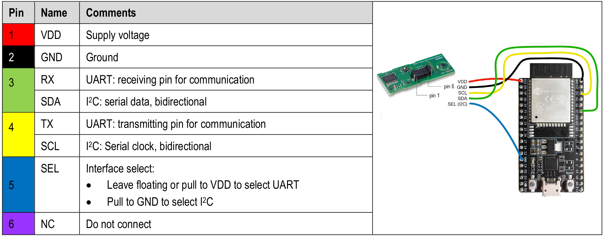
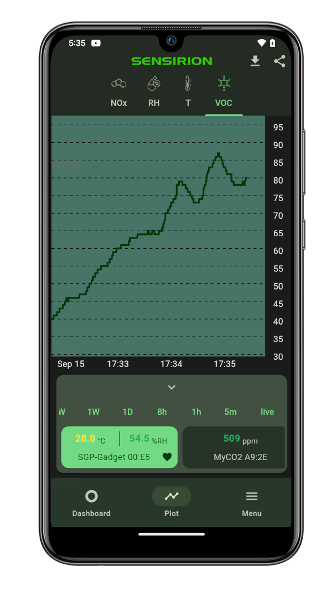

# Tutorial: SVM41 BLE Gadget

## Summary

This tutorial enables you to setup a VOC and NOx-Monitor sending Temperature, Humidity, Volatile Organic Compound (VOC) and NOx measurements via Bluetooth to nearby mobile phones. All steps necessary and links to the compatible app for the Gadget interaction (Android and iOS) are provided here.

The tutorial is structured in 3 parts:

- **Hardware Setup**: Learn how to wire the sensor to the development board.
- **Software Setup**: Learn how to setup your computer to program the development board.
- **Monitor Setup**: Learn how to monitor your VOC and NOx levels on your computer and via the _Sensirion MyAmbience_ app.

## Hardware Setup

To complete this tutorial, you'll need:

- [ESP32 DevKitC-32D](https://www.espressif.com/en/products/devkits/esp32-devkitc) (available [here](https://www.digikey.com/en/products/detail/espressif-systems/ESP32-DEVKITC-32D/9356990))
- [Sensirions SEK-SVM41](https://sensirion.com/my-sgp-ek) (available [here](https://www.digikey.ch/de/products/detail/sensirion-ag/SEK-SVM41/15293465))
- USB cable to connect the ESP32 DevKitC module to your computer

Connect the SEK-SVM41 module to the ESP32 DevKitC as depicted below. Please note, that your developer kit may have a
different pin layout. If you're using different pins or have a different layout, you might have to adjust the code
accordingly.

| _SVM41_ | _ESP32_     | _Jumper Wire_ |
| ------- | ----------- | ------------- |
| VDD     | 3.3         | Red           |
| GND     | GND         | Black         |
| SDA     | SDA         | Green         |
| SCL     | SCL         | Yellow        |
| SEL     | GND for I2C | Blue          |

| _Pin_ | _Name_ | _Description_                   | _Comments_                       |
| ----- | ------ | ------------------------------- | -------------------------------- |
| 1     | VDD    | Supply Voltage                  | 3.3V or 5V ±10%                  |
| 2     | GND    | Ground                          |
| 3     | SDA    | I2C: Serial data input / output | TTL 5V and LVTTL 3.3V compatible |
| 4     | SCL    | I2C: Serial clock input         | TTL 5V and LVTTL 3.3V compatible |
| 5     | SEL    | Interface select                | Pull to GND                      |
| 6     | NC     | Do not connect                  |

## Software Setup

### Setup the Arduino IDE for the ESP32 platform

The following instructions originate from [here](https://github.com/espressif/arduino-esp32)

1. Install the current version of the [Arduino IDE](https://www.arduino.cc/en/software).
2. Start the Arduino IDE and open the Preferences window from `File -> Preferences`.
3. Enter the following link into the _Additional Board Manager URLs_ field. You can add multiple URLs, separating them with commas.
   - `https://dl.espressif.com/dl/package_esp32_index.json`
4. Open the Boards Manager from `Tools -> Board -> Board Manager` and install the _esp32_ platform
5. Select your ESP32 board from the `Tools -> Board` menu after the successfull installation.
   - E.g. `ESP32 Dev Module`

### Setup the requried libraries

We'll be installing the following libraries using the library manager included with Arduino IDE:

- [Sensirion GadgetBle Arduino Library](https://github.com/Sensirion/Sensirion_GadgetBle_Arduino_Library/releases)
- [Sensirion SVM41 Arduino Library](https://github.com/Sensirion/arduino-i2c-svm41/releases)
- [Sensirion Arduino Core Library](https://github.com/Sensirion/arduino-core) (dependency of _Sensirion Gadget BLE Arduino Library_)
- [Sensirion UPT Core](https://github.com/Sensirion/upt-core) (dependency of _Sensirion Gadget BLE Arduino Library_)
- [NimBLE-Arduino Library](https://github.com/h2zero/NimBLE-Arduino) (dependency of _Sensirion Gadget BLE Arduino Library_)

Once done, it is good to restart the Arduino IDE.

### Launch the Gadget Firmware

1. Open the Arduino IDE.
2. Go to `File -> Examples -> Sensirion Gadget BLE Lib -> Example12_SVM41_BLE_Gadget`.
3. Make sure the ESP32 is connected to your computer.
4. Press the Upload button on the top left corner of the Arduino IDE.

## Monitor Setup

### Value plotting on your Computer

To verify that everything is working fine, open the Serial Plotter, while your ESP32 ist still connected to your computer to see the sensor values measured by the SVM41 module:

1. Go to `Tools -> Serial Plotter`
2. Make sure on the bottom left corner `115200 baud` is selected, as depicted in the image below

You should see the measured values plotted in the opened window. Alternatively you can choose `Tools -> Serial Monitor` to see the values in text form.

### Monitor your Temperature, Humidity, VOC and NOx levels via Mobile App

Download the **Sensirion MyAmbience** app to monitor your sensor signals, download history values and export and share the data with your friends.

Note that on Android devices the Location services need to be enabled and the corresponding permissions granted to the application. This is required to allow the app to continuously scan for nearby Bluetooth devices. This is a requirement of the Android OS for Bluetooth scanning. The app itself does not use your location.

Note that the default name for your SVM41 Gadget will be "SGP-Gadget", but you can easily change this in the sensor settings.

## PlatformIO Support

The folder _Example12_SVM41_BLE_Gadget_ contains a `platformio.ini` file which allows you to use [PlatformIO](https://platformio.org/) instead fo ArduinoIDE if you wish to do so.
