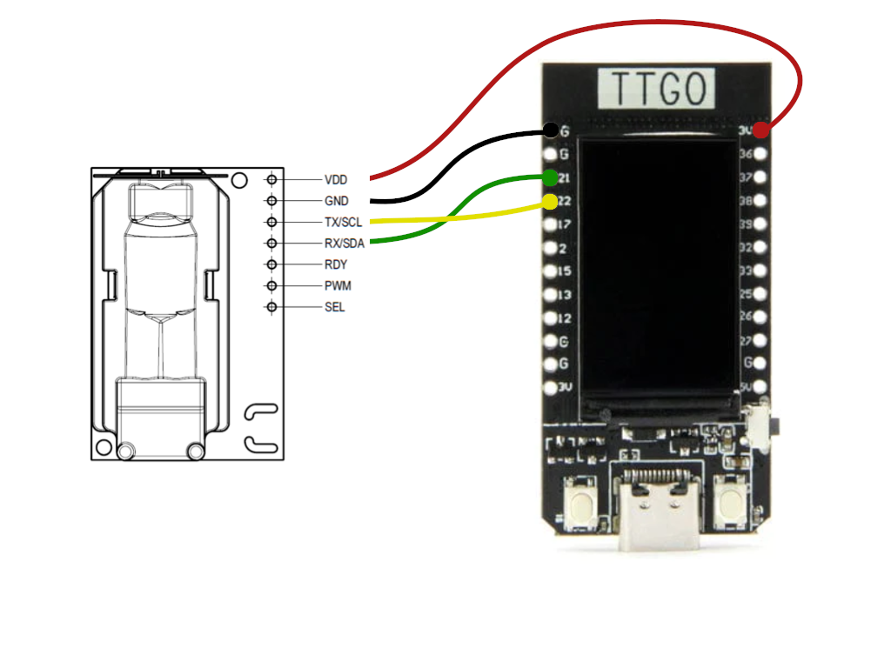
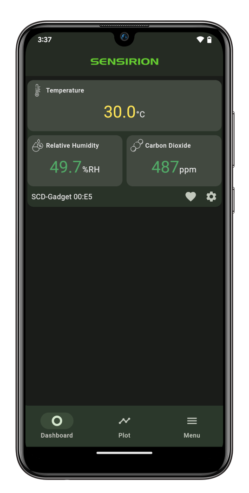
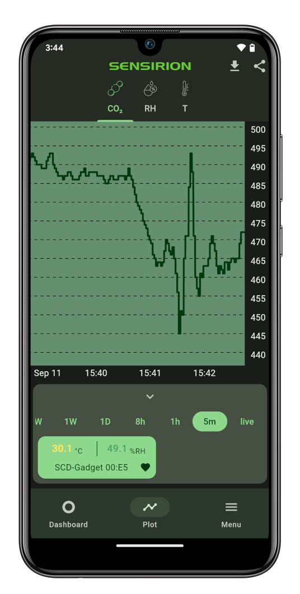

# Tutorial: SCD30 BLE Gadget with Screen

## Summary

This tutorial enables you to setup a CO2-Monitor sending CO2 measurements via Bluetooth to nearby mobile phones. It also features a onboard screen to directly read the C02 measurements. More specifically, we will here use a **LILYGO® TTGO T-Display ESP32** which is an ESP32 DevKit with a small 1.14 inch display attached.

All steps necessary and links to the compatible app for Android and iOS are provided here.

The tutorial is structured in 3 parts:

- **Hardware Setup**: Learn how to wire the sensor to the development board.
- **Software Setup**: Learn how to setup your computer to program the development board.
- **Monitor Setup**: Learn how to monitor your CO2 levels on your computer and via the _Sensirion MyAmbience_ app.

## Hardware Setup

To complete this tutorial, you'll need:

- [LILYGO® TTGO T-Display ESP32](https://www.lilygo.cc/products/lilygo%C2%AE-ttgo-t-display-1-14-inch-lcd-esp32-control-board)
- [Sensirion SCD30 Sensor](https://www.sensirion.com/en/environmental-sensors/carbon-dioxide-sensors/carbon-dioxide-sensors-co2/) (available [here](https://www.digikey.com/en/products/detail/sensirion-ag/SCD30/8445334) or with [Grove Plug](https://www.digikey.com/en/products/detail/seeed-technology-co-ltd/101020634/10060357?s=N4IgTCBcDaIMoGEAiBmADCAugXyA) if you don't want to solder anything)
- Cables for soldering the connection or a Grove-to-Jumper cable (available [here](https://www.digikey.com/en/products/detail/seeed-technology-co-ltd/110990028/5482559?s=N4IgTCBcDaIOYCcD2A3ApgAgC5IwKwFcBbABzQQwDM0iBDAGzRAF0BfIA))
- USB cable to connect the ESP32 DevKitC module to your computer

Connect the SCD30 sensor to the TTGO T-Display ESP32 as depicted below. Please note, that your developer kit may have a
different pin layout. If you're using different pins or have a different layout, you might have to adjust the code
accordingly.

- **VDD** of the SCD30 to the **3.3V** of the ESP32
- **GND** of the SCD30 to the **GND** of the ESP32
- **SCL** of the SCD30 to the **IO22** of the ESP32
- **SDA** of the SCD30 to the **IO21** of the ESP32

## Software Setup

### Setup the Arduino IDE for the ESP32 platform

The following instructions originate from [here](https://github.com/espressif/arduino-esp32)

1. Install the current version of the [Arduino IDE](https://www.arduino.cc/en/software) (at least 2.0).
2. Open the Boards Manager and install the _esp32_ platform (by Esspressif Systems).
3. Select your ESP32 board from the `Tools -> Board` menu after the successfull installation.
   - E.g. `ESP32 Dev Module`

### Setup the required libraries

We'll be installing the following libraries using the library manager included with Arduino IDE:

- [Sensirion Gadget BLE Arduino Library](https://github.com/Sensirion/Sensirion_GadgetBle_Arduino_Library/releases)
- [Sensirion I2C SCD30](https://github.com/Sensirion/arduino-i2c-scd30)
- [NimBLE](https://github.com/h2zero/NimBLE-Arduino) (dependency of _Sensirion Gadget BLE Arduino Library_)
- [Sensirion Core](https://github.com/Sensirion/arduino-core/) (dependency of _Sensirion Gadget BLE Arduino Library_)
- [Sensirion UPT Core](https://github.com/Sensirion/upt-core) (dependency of _Sensirion Gadget BLE Arduino Library_)

Additionally to use the onboard screen we will install the **TFT_eSPI** libray using the instructions below

Once done, it is good to restart the Arduino IDE.

#### TFT_eSPI library installation

1. Go to [TTGO T-Display's Github Repository](https://github.com/Xinyuan-LilyGO/TTGO-T-Display)
   - [Download the code as zip](https://github.com/Xinyuan-LilyGO/TTGO-T-Display/archive/master.zip) and extract its content
2. Copy the Folder `TFT_eSPI` to your Arduino library path
   - On Windows, this is by default `C:\Users\Your User Name\Documents\Arduino\libraries`

### Launch the CO2 Monitor

1. Open the Arduino IDE.
2. Go to `File -> Examples -> Sensirion Gadget BLE Lib -> Example3_SCD30_BLE_TTGO_Gadget`.
3. Make sure the ESP32 is connected to your computer.
4. Press the Upload button on the top left corner of the Arduino IDE.

## Monitor Setup

### Value plotting on your Computer

To verify that everything is working fine, open the Serial Plotter, while your ESP32 ist still connected to your computer to see the sensor values measured by the SCD30 sensor:

1. Go to `Tools -> Serial Plotter`
2. Make sure on the bottom left corner `115200 baud` is selected, as depicted in the image below

### Monitor your CO2 levels via Mobile App

Download the **Sensirion MyAmbience** app to monitor your CO2 levels, download history values and export and share the data with your friends.

- [Download for Android](https://play.google.com/store/apps/details?id=com.sensirion.myam)
- [Download for iOS](https://apps.apple.com/ch/app/id1529131572)

Note that on Android devices the Location services need to be enabled and the corresponding permissions granted to the application. This is required to allow the app to scan for nearby Bluetooth devices. This is a requirement of the Android OS for Bluetooth scanning. The app itself **does not use your location**.

## PlatformIO Support

The folder _Example3_SCD30_BLE_TTGO_Gadget_ contains a `platformio.ini` file which allows you to use PlatformIO instead fo ArduinoIDE if you wish to do so.
