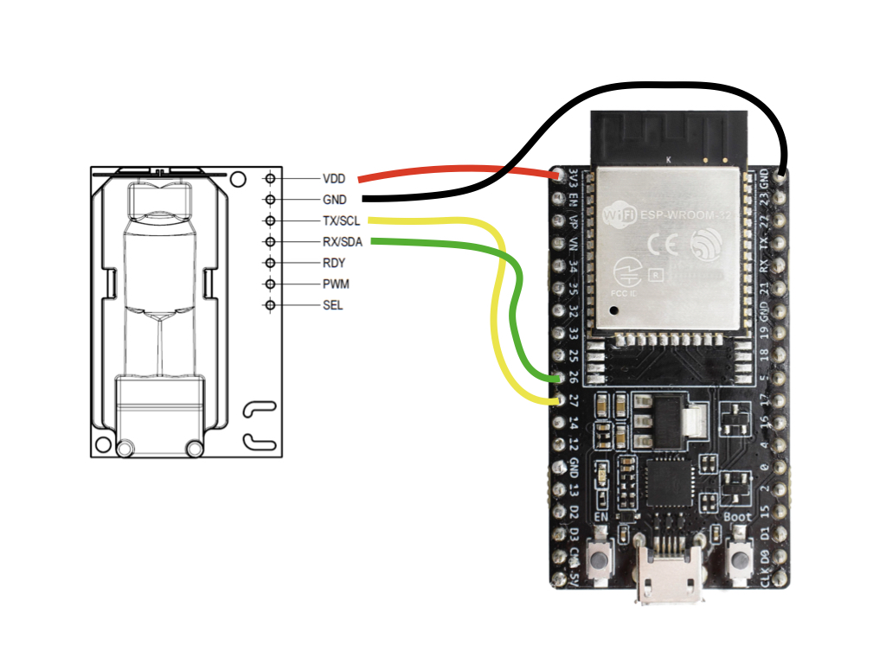
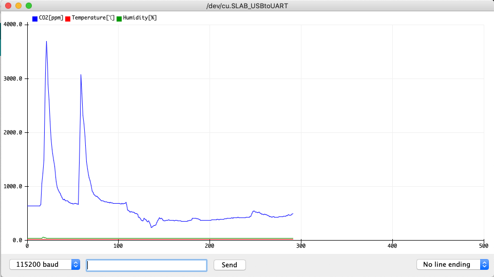
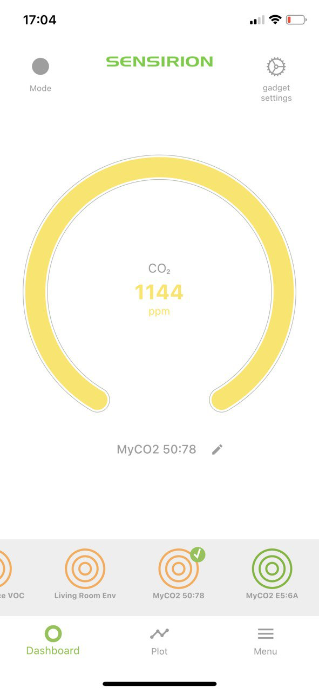
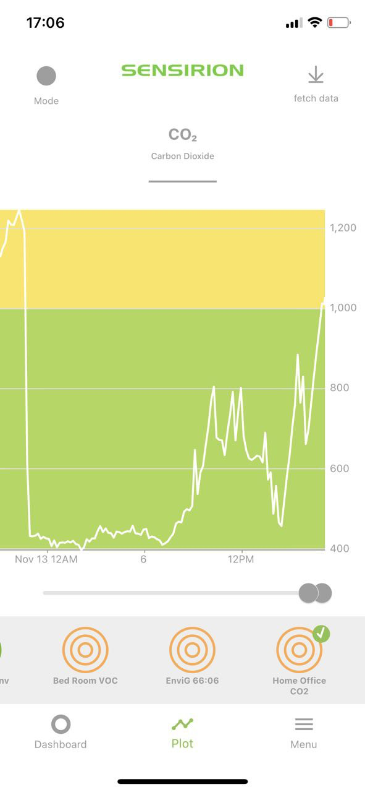
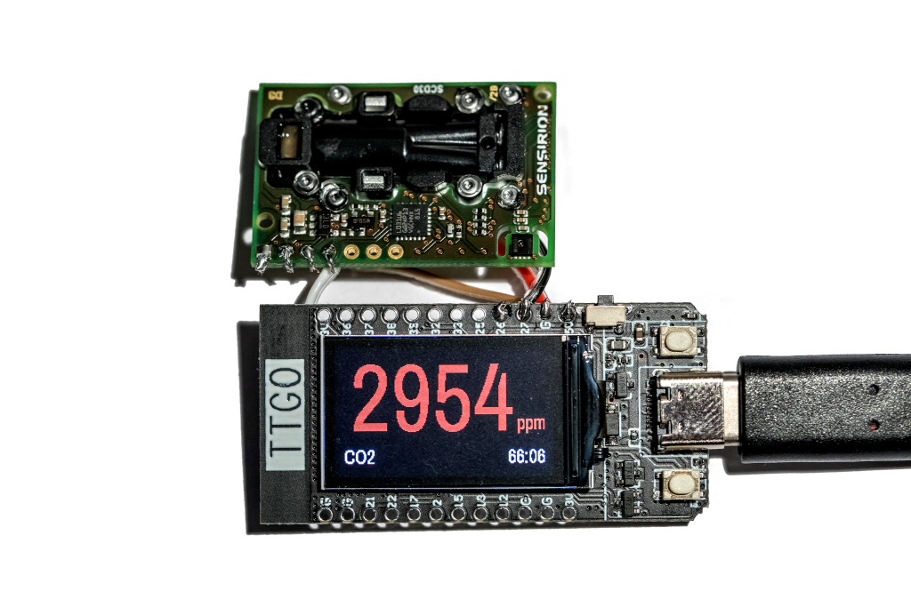

# Tutorial: Bluetooth CO2-Monitor with SCD30

## Summary

This tutorial enables you to setup a CO2-Monitor sending CO2 measurements via Bluetooth to nearby mobile phones. All steps necessary and links to the compatible app for Android and iOS are provided here.

The tutorial is structured in 3 parts

* **Hardware Setup**: Learn how to wire the sensor to the development board
* **Software Setup**: Learn how to setup your computer to program the development board
* **Monitor Setup**: Learn how to monitor your CO2 levels on your computer and via the *Sensirion MyAmbience* app

If you have a [LILYGO® TTGO T-Display ESP32](http://www.lilygo.cn/prod_view.aspx?TypeId=50033&Id=1126&FId=t3:50033:3) then make sure to follow the instructions on the very bottom of this tutorial to enable the UI of your gadget.

## Hardware Setup

To complete this tutorial, you'll need

* [ESP32 DevKitC-32D](https://www.espressif.com/en/products/devkits/esp32-devkitc) (
  available [here](https://www.digikey.com/en/products/detail/espressif-systems/ESP32-DEVKITC-32D/9356990))
* [Sensirions SCD30 Sensor](https://www.sensirion.com/en/environmental-sensors/carbon-dioxide-sensors/carbon-dioxide-sensors-co2/) (available [here](https://www.digikey.com/en/products/detail/sensirion-ag/SCD30/8445334) or with [Grove Plug](https://www.digikey.com/en/products/detail/seeed-technology-co-ltd/101020634/10060357?s=N4IgTCBcDaIMoGEAiBmADCAugXyA) if you don't want to solder anything)
* Cables for soldering the connection or a Grove-to-Jumper cable (available [here](https://www.digikey.com/en/products/detail/seeed-technology-co-ltd/110990028/5482559?s=N4IgTCBcDaIOYCcD2A3ApgAgC5IwKwFcBbABzQQwDM0iBDAGzRAF0BfIA))
* USB cable to connect the ESP32 DevKitC module to your computer

Connect the SCD30 sensor to the ESP32 DevKitC as depicted below. Please note, that your developer kit may have a
different pin layout. If you're using different pins or have a different layout, you might have to adjust the code
accordingly.

* **VDD** of the SCD30 to the **3.3V** of the ESP32
* **GND** of the SCD30 to the **GND** of the ESP32
* **SCL** of the SCD30 to the **IO22** of the ESP32
* **SDA** of the SCD30 to the **IO21** of the ESP32

## Software Setup

### Setup the Arduino IDE for the ESP32 platform

The following instructions originate from [here](https://github.com/espressif/arduino-esp32)

1. Install the current version of the [Arduino IDE](https://www.arduino.cc/en/software).
2. Start the Arduino IDE and open the Preferences window from `File -> Preferences`.
3. Enter the following link into the *Additional Board Manager URLs* field. You can add multiple URLs, separating them with commas.
	* `https://dl.espressif.com/dl/package_esp32_index.json`
4. Open the Boards Manager from `Tools -> Board -> Board Manager` and install the *esp32* platform
5. Select your ESP32 board from the `Tools -> Board` menu after the successfull installation.
	* E.g. `ESP32 Dev Module`

### Setup the requried libraries

We'll be installing the following libraries. Click the links below and download the newest .zip release packages

* The [Sensirion GadgetBle Arduino Library](https://github.com/Sensirion/Sensirion_GadgetBle_Arduino_Library/releases)
* The [SCD30 Sensor Driver](https://github.com/Seeed-Studio/Seeed_SCD30/releases/latest) by SeeedStudio
* The [NimBLE-Arduino Library](https://github.com/h2zero/NimBLE-Arduino)

For each of the downloaded .zip files: In the Arduino IDE, select `Sketch -> include Library -> Add .zip Library` and select the .zip file.

Restart the Arduino IDE.

### Launch the CO2 Monitor

1. Open the Arduino IDE.
2. Go to `File -> Examples -> Sensirion Gadget BLE Lib -> Example2_SCD30_BLE_Gadget`.
3. Make sure the ESP32 is connected to your computer.
4. Press the Upload button on the top left corner of the Arduino IDE.

## Monitor Setup

### Value plotting on your Computer

To verify that everything is working fine, open the Serial Plotter, while your ESP32 ist still connected to your computer to see the sensor values measured by the SCD30 sensor:

1. Go to `Tools -> Serial Plotter`
2. Make sure on the bottom left corner `115200 baud` is selected, as depicted in the image below

### Monitor your CO2 levels via Mobile App

Download the **Sensirion MyAmbience** app to monitor your CO2 levels, download history values and export and share the data with your friends.

* [Download for Android](https://play.google.com/store/apps/details?id=com.sensirion.myam)
* [Download for iOS](https://apps.apple.com/ch/app/id1529131572)

Note that on Android devices the Location services need to be enabled and the corresponding permissions granted to the application. This is required to allow the app to scan for nearby Bluetooth devices. This is a requirement of the Android OS for Bluetooth scanning. The app itself does not use your location.

## Additional Steps for LILYGO® TTGO T-Display ESP32

The LILYGO® TTGO T-Display ESP32 is an ESP32 DevKit with a small 1.14 inch display attached. This allows us to visualize the current CO2 concentration and level color in green, yellow or red, depending if the CO2 level is good, bad or very bad.

Caution: This picture shows an alternative wiring. Use the instructions described in section *Hardware Setup*

Follow all the instructions above and additionally do the following:

1. Go to [TTGO T-Display's Github Repository](https://github.com/Xinyuan-LilyGO/TTGO-T-Display)
	* [Download the code as zip](https://github.com/Xinyuan-LilyGO/TTGO-T-Display/archive/master.zip) and extract its content
2. Copy the Folder `TFT_eSPI` to your Arduino library path
	* On Windows, this is by default `C:\Users\Your User Name\Documents\Arduino\libraries`
3. In the same library path, open the Sensirion Gadget Ble Arduino Library folder, then Examples, then Example 3 and copy the content as follows into the `TFT_eSPI` folder
	* Copy all files in the folder `fonts` to `TFT_eSPI/Fonts/Custom/`
	* Copy the file `User_Custom_Fonts.h` to `TFT_eSPI/User_Setups/`
4. In the Arduino IDE, open **Example 3** by clicking on `File -> Examples -> Sensirion Gadget BLE Lib -> Example3_SCD30_BLE_TTGO_Gadget`
5. Press the Upload button.
