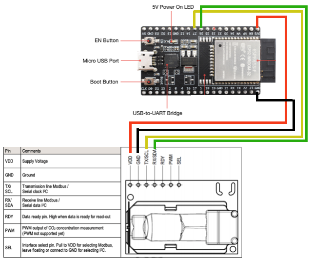

# Tutorial: Bluetooth CO2-Monitor with SCD30

## Summary

This tutorial enables you to setup a CO2-Monitor sending CO2 measurements via Bluetooth to nearby mobile phones. All steps necessary and a compatible app for Android and iOS are provided here.

The tutorial is structured in 3 parts

* **Hardware Setup**: Learn how to wire the sensor to the development board
* **Software Setup**: Learn how to setup your computer to program the development board
* **Monitor Setup**: Learn how to monitor your CO2 levels on your computer and via the *Sensirion MyAmbience CO2* app

## Hardware Setup

To complete this tutorial, you'll need

* [ESP32 DevKitC](https://www.espressif.com/en/products/devkits/esp32-devkitc) (available [here](https://www.digikey.com/en/products/detail/espressif-systems/ESP32-DEVKITC-32D/9356990))
* [Sensirions SCD30 Sensor](https://www.sensirion.com/en/environmental-sensors/carbon-dioxide-sensors/carbon-dioxide-sensors-co2/) (available [here](https://www.digikey.com/en/products/detail/sensirion-ag/SCD30/8445334) or with [Grove Plug](https://www.digikey.com/en/products/detail/seeed-technology-co-ltd/101020634/10060357?s=N4IgTCBcDaIMoGEAiBmADCAugXyA) if you don't want to solder anything)
* Cables for soldering the connection or a Grove-to-Jumper cable (available [here](https://www.digikey.com/en/products/detail/seeed-technology-co-ltd/110990028/5482559?s=N4IgTCBcDaIOYCcD2A3ApgAgC5IwKwFcBbABzQQwDM0iBDAGzRAF0BfIA))
* USB cable to connect the ESP32 DevKitC module to your computer

Connect the SCD30 sensor as depicted below:

* Connect the VDD to the 3.3V pin of the ESP32
* Connect GND to GND on the ESP32
* Connect the **SDA** pin to **GPIO 26**
* Connect the **SCL** pin to **GPIO 27**

## Software Setup

### Setup the Arduino IDE for the ESP32 platform

The following instructions originate from [here](https://github.com/espressif/arduino-esp32)

1. Install the current version of the [Arduino IDE](http://www.arduino.cc/en/main/software).
2. Start the Arduino IDE and open the Preferences window.
3. Enter the following link above into *Additional Board Manager URLs* field. You can add multiple URLs, separating them with commas.
	* `https://raw.githubusercontent.com/espressif/arduino-esp32/gh-pages/package_esp32_index.json`
4. Open the Boards Manager from `Tools > Board -> Board Manager` and install the *esp32* platform
5. Select your ESP32 board from the `Tools > Board` menu after the successfull installation.
	* E.g. `ESP32 Dev Module`

### Setup the requried libraries

We'll be installing 2 libraries. Click the links below and download the newest .zip release packages

* The [Sensirion GadgetBle Arduino Library](https://github.com/Sensirion/Sensirion_GadgetBle_Arduino_Library/releases)
* The [SCD30 Sensor Driver](https://github.com/Seeed-Studio/Seeed_SCD30/releases/latest) by SeeedStudio

For each of the downloaded .zip files: In the Arduino IDE, select `Sketch -> include Library -> Add .zip Library` and select the .zip file.

### Launch the CO2 Monitor

1. Open the Arduino IDE.
2. Go to `File -> Examples -> Sensirion Gadget BLE Lib -> Example2_SCD30_BLE_Gadget`.
3. Make sure the ESP32 is connected to your computer.
4. Press the Upload button on the top left corner of the Arduino IDE.

## Monitor Setup

### Value plotting on your Computer

To verify that everything is working fine, open the Serial Plotter, while your ESP32 ist still connected to your computer to see the sensor values measured by the SCD30 sensor:

1. Go to `Tools -> Serial Plotter`
2. Make sure on the bottom left corner `115200 baud` is selected, as depicted in the image below

### Monitor your CO2 levels via Mobile App

Download the **Sensirion MyAmbience CO2** app to monitor your CO2 levels, download history values and export and share the data with your friends.

* [Download for Android](https://play.google.com/store/apps/details?id=com.sensirion.myam)
* [Download for iOS](https://apps.apple.com/ch/app/sensirion-myambience-co2/id1529131572) 

Note that on Android devices the Location services need to be enabled and the corresponding permissions granted to the application. This is required to allow the app to scan for nearby Bluetooth devices. This is a requirement of the Android OS for Bluetooth scanning. The app itself does not use your location.

