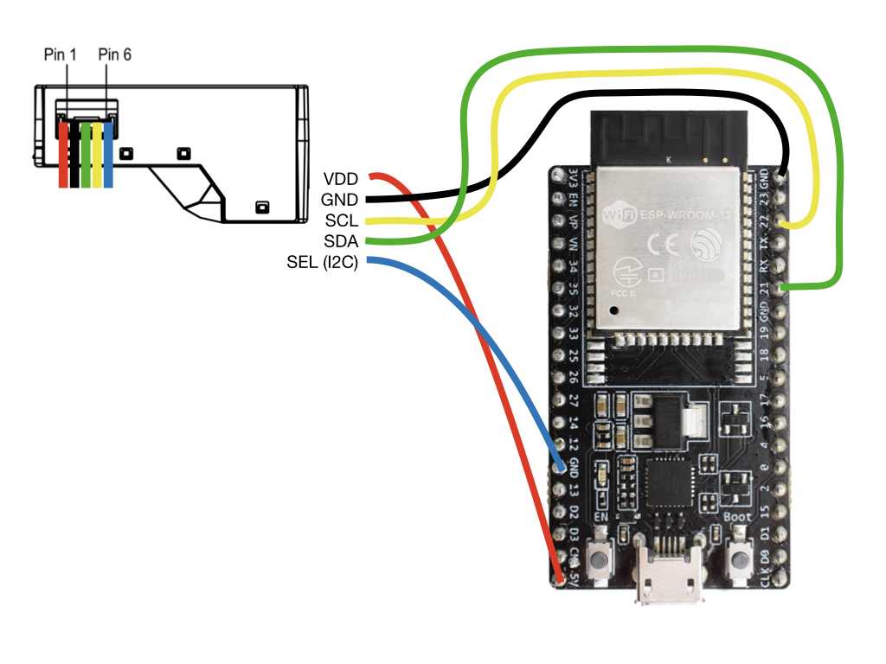
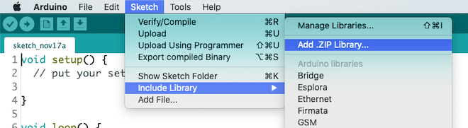
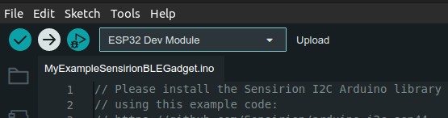

# Tutorial: SEN54 BLE Gadget

## Summary

This tutorial enables you to setup an Environmental-Air-Quality-Monitor sending Temperature, Humidity, VOC Index and
Particulate Matter (PM 2.5) measurements via Bluetooth to nearby mobile phones. All steps necessary and links to the
compatible app for the interaction with the created Gadget are provided here.

The tutorial is structured in 3 parts

* **Hardware Setup**: Learn how to wire the sensor to the development board
* **Software Setup**: Learn how to setup your computer to program the development board
* **Monitor Setup**: Learn how to monitor your environment on your computer and via the *Sensirion MyAmbience* app

## Hardware Setup

To complete this tutorial, you'll need

* [ESP32 DevKitC-32D](https://www.espressif.com/en/products/devkits/esp32-devkitc) (
  available [here](https://www.digikey.com/en/products/detail/espressif-systems/ESP32-DEVKITC-32D/9356990))
* [Sensirion SEN54 Sensor Module](https://sensirion.com/my-sen-ek)
* USB cable to connect the ESP32 DevKitC module to your computer

Connect the SEN54 module to the ESP32 DevKitC as depicted below. Please note, that your developer kit may have a
different pin layout. If you're using different pins or have a different layout, you might have to adjust the code
accordingly.

| *SEN54* |   *Arduino*    | *Jumper Wire* |
|---------|----------------|---------------|
|   VCC   |       5V       |     Red       |
|   GND   |       GND      |     Black     |
|   SDA   |       SDA      |     Green     |
|   SCL   |       SCL      |     Yellow    |
|   SEL   |   GND for I2C  |     Blue      |

| *Pin* | *Name* | *Description* | *Comments* |
|-------|--------|---------------|------------|
| 1     | VDD    | Supply Voltage | 5V ±10%
| 2     | GND    | Ground |
| 3     | SDA    | I2C: Serial data input / output | TTL 5V and LVTTL 3.3V compatible
| 4     | SCL    | I2C: Serial clock input | TTL 5V and LVTTL 3.3V compatible
| 5     | SEL    | Interface select | Pull to GND
| 6     | NC     | Do not connect |

## Software Setup

### Setup the Arduino IDE for the ESP32 platform

The following instructions originate from [here](https://github.com/espressif/arduino-esp32)

1. Install the current version of the [Arduino IDE](https://www.arduino.cc/en/software).
2. Start the Arduino IDE and open the Preferences window from `File -> Preferences`.
3. Enter the following link into the *Additional Board Manager URLs* field. You can add multiple URLs, separating them
   with commas.
    * `https://dl.espressif.com/dl/package_esp32_index.json`
4. Open the Boards Manager from `Tools -> Board -> Board Manager` and install the *esp32* platform
5. Select your ESP32 board from the `Tools -> Board` menu after the successfull installation.
    * E.g. `ESP32 Dev Module`

### Setup the requried libraries

We'll be installing the following libraries. Click the links below and download the newest .zip release packages

* The [Sensirion GadgetBle Arduino Library](https://github.com/Sensirion/Sensirion_GadgetBle_Arduino_Library/releases)
* The [Sensirion I2C SEN5x Arduino Library](https://github.com/Sensirion/arduino-i2c-sen5x)
* The [Sensirion Arduino Core Library](https://github.com/Sensirion/arduino-core)
* The [NimBLE-Arduino Library](https://github.com/h2zero/NimBLE-Arduino)

For the downloaded .zip file: In the Arduino IDE, select `Sketch -> include Library -> Add .zip Library` and select the
downloaded .zip file.

Restart the Arduino IDE.

### Launch the Gadget Firmware

1. Open the Arduino IDE.
2. Go to `File -> Examples -> Sensirion Gadget BLE Lib -> Example10_SEN54_BLE_Gadget`.
3. Make sure the ESP32 is connected to your computer.
4. Press the Upload button on the top left corner of the Arduino IDE.

## Monitor Setup

### Value plotting on your Computer

To verify that everything is working fine, open the Serial Monitor, while your ESP32 ist still connected to your
computer to see the sensor values measured by the SEN54 module:

1. Go to `Tools -> Serial Monitor`
2. Make sure on the bottom left corner `115200 baud` is selected, as depicted in the image below

You should see the measured values plotted in the opened window. Alternatively you can choose `Tools -> Serial Plotter`
to see the values in a plot.

### Monitor your Environment via Mobile App

Download the **Sensirion MyAmbience** app to monitor your sensor signals, download history values and export and share
the data with your friends.

* [Download for Android](https://play.google.com/store/apps/details?id=com.sensirion.myam)
* [Download for iOS](https://apps.apple.com/ch/app/id1529131572)

Note that on Android devices the Location services need to be enabled and the corresponding permissions granted to the
application. This is required to allow the app to continuously scan for nearby Bluetooth devices. This is a requirement
of the Android OS for Bluetooth scanning. The app itself does not use your location.
