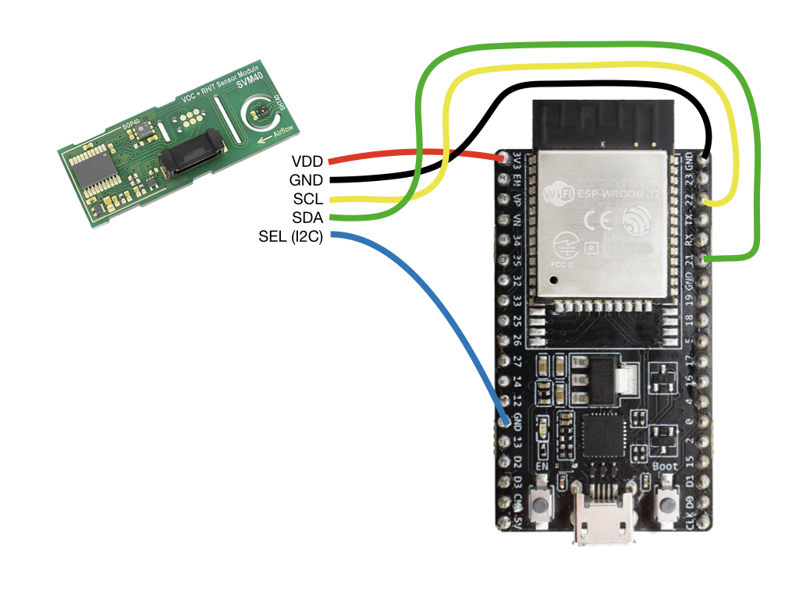
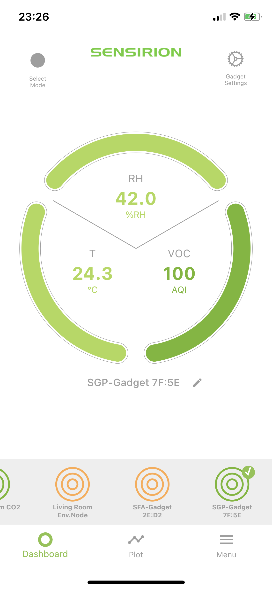

# Tutorial: SVM40 BLE Gadget

## Summary

This tutorial enables you to setup a VOC-Monitor sending Temperature, Humidity and Volotile Organic Compound (VOC) measurements via Bluetooth to nearby mobile phones. All steps necessary and links to the compatible app for the Gadget interaction (Android and iOS) are provided here.

The tutorial is structured in 3 parts

* **Hardware Setup**: Learn how to wire the sensor to the development board
* **Software Setup**: Learn how to setup your computer to program the development board
* **Monitor Setup**: Learn how to monitor your VOC levels on your computer and via the *Sensirion MyAmbience* app

## Hardware Setup

To complete this tutorial, you'll need

* [ESP32 DevKitC-32D](https://www.espressif.com/en/products/devkits/esp32-devkitc) (available [here](https://www.digikey.com/en/products/detail/espressif-systems/ESP32-DEVKITC-32D/9356990))
* [Sensirions SEK-SVM40](https://sensirion.com/products/catalog/SEK-SVM4x/) (available [here](https://www.digikey.com/en/products/detail/sensirion-ag/SEK-SVM40/12820417?s=N4IgTCBcDaIMoDUCyAWADCAugXyA))
* USB cable to connect the ESP32 DevKitC module to your computer

Connect the SEK-SVM40 module to the ESP32 DevKitC as depicted below. Please note, that your developer kit may have a
different pin layout. If you're using different pins or have a different layout, you might have to adjust the code
accordingly.

* **VDD** of the SEK-SVM40 to the **3.3V** of the ESP32
* **GND** of the SEK-SVM40 to the **GND** of the ESP32
* **SCL** of the SEK-SVM40 to the **IO22** of the ESP32
* **SDA** of the SEK-SVM40 to the **IO21** of the ESP32
* **SEL** of the SEK-SVM40 to the **GND** of the ESP32  (choosing the I2C interface)

## Software Setup

### Setup the Arduino IDE for the ESP32 platform

The following instructions originate from [here](https://github.com/espressif/arduino-esp32)

1. Install the current version of the [Arduino IDE](https://www.arduino.cc/en/software).
2. Start the Arduino IDE and open the Preferences window from `File -> Preferences`.
3. Enter the following link into the *Additional Board Manager URLs* field. You can add multiple URLs, separating them with commas.
	* `https://dl.espressif.com/dl/package_esp32_index.json`
4. Open the Boards Manager from `Tools -> Board -> Board Manager` and install the *esp32* platform
5. Select your ESP32 board from the `Tools -> Board` menu after the successfull installation.
	* E.g. `ESP32 Dev Module`

### Setup the requried libraries

We'll be installing the following libraries. Click the link below and download the newest .zip release packages

* The [Sensirion GadgetBle Arduino Library](https://github.com/Sensirion/Sensirion_GadgetBle_Arduino_Library/releases)
* The [Sensirion I2C SVM40 Arduino Library](https://github.com/Sensirion/arduino-i2c-svm40)
* The [Sensirion Arduino Core Library](https://github.com/Sensirion/arduino-core)
* The [NimBLE-Arduino Library](https://github.com/h2zero/NimBLE-Arduino)

For each of the downloaded .zip files: In the Arduino IDE, select `Sketch -> include Library -> Add .zip Library` and select the downloaded .zip file.

Restart the Arduino IDE.

### Launch the Gadget Firmware

1. Open the Arduino IDE.
2. Go to `File -> Examples -> Sensirion Gadget BLE Lib -> Example5_SVM40_BLE_Gadget`.
3. Make sure the ESP32 is connected to your computer.
4. Press the Upload button on the top left corner of the Arduino IDE.

## Monitor Setup

### Value plotting on your Computer

To verify that everything is working fine, open the Serial Plotter, while your ESP32 ist still connected to your computer to see the sensor values measured by the SVM40 module:

1. Go to `Tools -> Serial Plotter`
2. Make sure on the bottom left corner `115200 baud` is selected, as depicted in the image below

You should see the measured values plotted in the opened window. Alternatively you can choose `Tools -> Serial Monitor` to see the values in text form.

### Monitor your Temperature, Humidity and VOC levels via Mobile App

Download the **Sensirion MyAmbience** app to monitor your sensor signals, download history values and export and share the data with your friends.

* [Download for Android](https://play.google.com/store/apps/details?id=com.sensirion.myam)
* [Download for iOS](https://apps.apple.com/ch/app/id1529131572)

Note that on Android devices the Location services need to be enabled and the corresponding permissions granted to the application. This is required to allow the app to continuously scan for nearby Bluetooth devices. This is a requirement of the Android OS for Bluetooth scanning. The app itself does not use your location.

